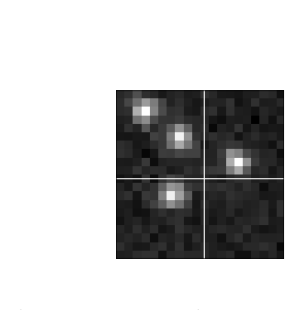
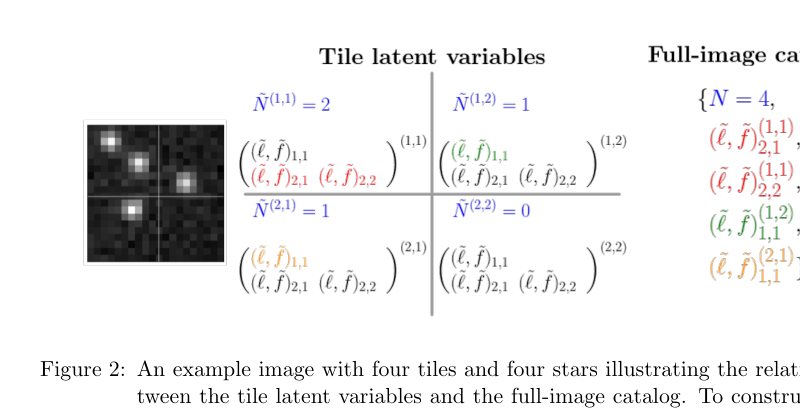
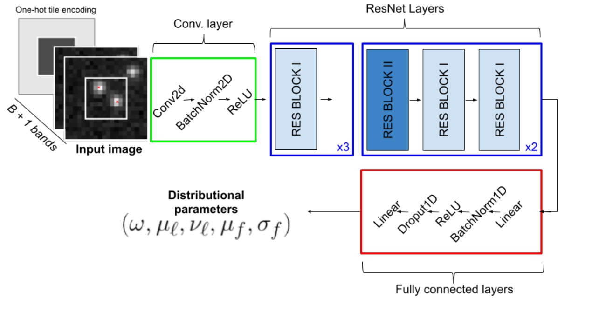
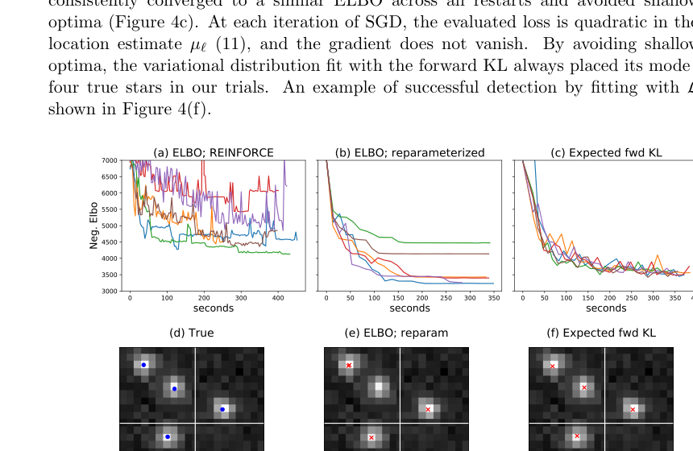
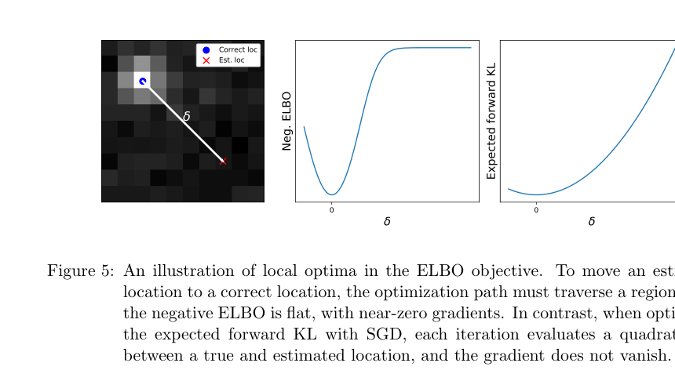
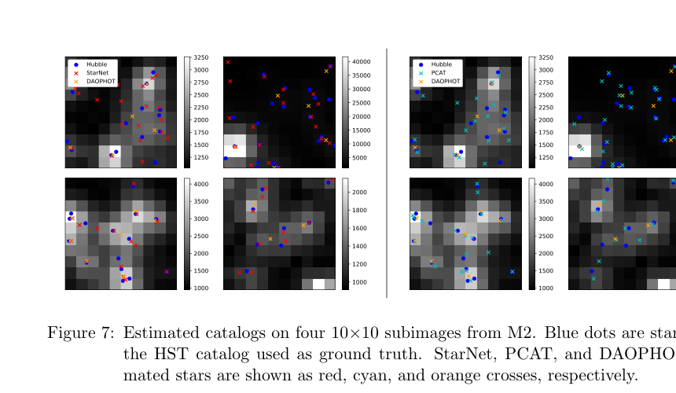
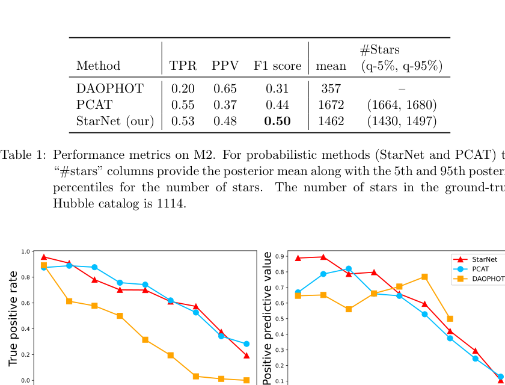
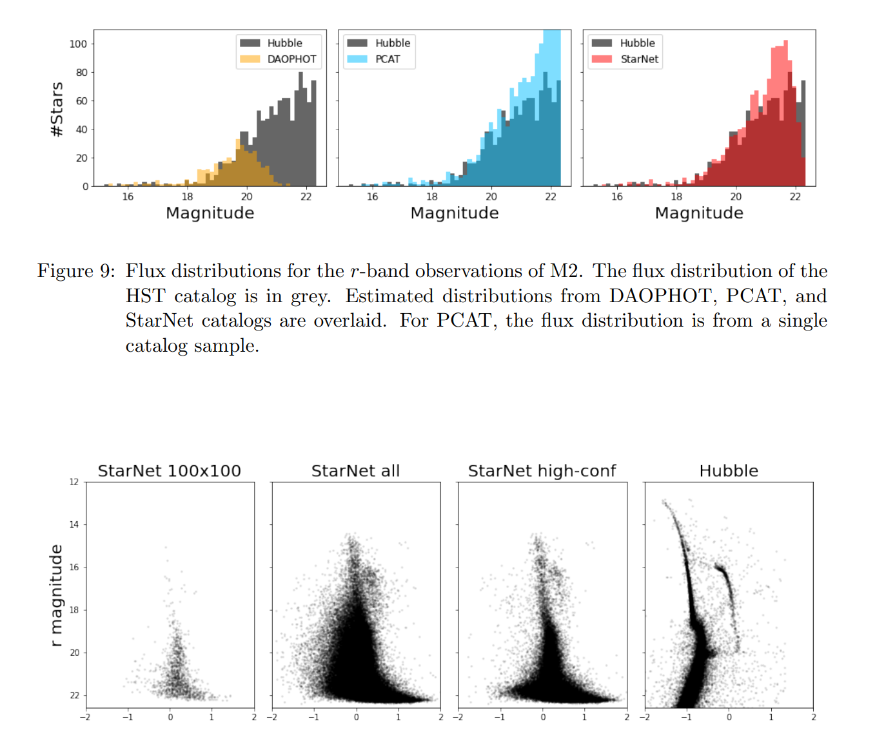

# 《Variational Inference for Deblending Crowded Starfields》中文论文笔记

> 适用方向：密集星场处理、源探测、去混叠（deblending）、星表构建  
> 论文方法：**StarNet**  
> 配套代码仓库：`Runjing-Liu120/DeblendingStarfields`

**注：笔记中的图片编号与论文相同**
---

## 目录

- [1. 一句话总结](#1-一句话总结)
- [2. 论文要解决什么问题](#2-论文要解决什么问题)
- [3. 生成模型：源探测为什么是“反演问题”](#3-生成模型源探测为什么是反演问题)
- [4. 图 1：为什么要切成 tile](#4-图-1为什么要切成-tile)
- [5. 图 2：tile 的结果如何拼回整图](#5-图-2tile-的结果如何拼回整图)
- [6. 每个 tile 内到底预测什么](#6-每个-tile-内到底预测什么)
- [7. 图 3：StarNet 网络结构与代码对应](#7-图-3starnet-网络结构与代码对应)
- [8. 为什么论文不用传统 ELBO，而用 forward KL](#8-为什么论文不用传统-elbo而用-forward-kl)
- [9. 图 4 和图 5：为什么 ELBO 容易卡住](#9-图-4-和图-5为什么-elbo-容易卡住)
- [10. 代码阅读路线：仓库应该怎么看](#10-代码阅读路线仓库应该怎么看)
- [11. M2 实验：论文结果说明了什么](#11-m2-实验论文结果说明了什么)
- [12. 图 7：局部子图对比最值得看](#12-图-7局部子图对比最值得看)
- [13. 表 1 + 图 8：指标对比与不同星等表现](#13-表-1--图-8指标对比与不同星等表现)
- [14. 图 9 与图 10：为什么不能只看检测率](#14-图-9-与图-10为什么不能只看检测率)
- [15. 这篇论文对源探测模块的可参考价值](#15-这篇论文对源探测模块的可参考价值)
- [16. 个人总结](#16-个人总结)

---

## 1. 一句话总结

这篇论文最重要的贡献，不是“又做了一个深度学习检测器”，而是把**密集星场中的源探测**写成了一个**概率生成模型 + 摊销变分推断**问题。

它要解决的不是“图里有没有亮点”，而是：

- 图里到底有多少颗星；
- 每颗星在哪里；
- 每颗星有多亮；
- 哪些结果可信，哪些区域本身就有歧义。

论文提出的 **StarNet** 既保留了概率星表方法对不确定性的表达能力，又用神经网络把推断速度大幅提了上来。因此，它对“密集星场源探测模块”的参考价值非常高。

---

## 2. 论文要解决什么问题

在稀疏星场中，一个亮峰通常就对应一颗星；但在密集星场中，同一个局部亮峰可能对应：

- 一颗亮星；
- 两颗距离很近的暗星；
- 多颗源叠加后的混合结果。

所以，源探测不再是简单的峰值检测，而变成了一个**去混叠（deblending）**问题：

> 给定观测图像，恢复最可能的星表（catalog），并给出其不确定性。

这一步把源探测从“图像处理小技巧”提升成了“基于成像模型的物理反演问题”。

---

## 3. 生成模型：源探测为什么是“反演问题”

论文把一张图像对应的隐藏变量写成一个星表：

$$
z := \{N,(\ell_i, f_{i,1}, \dots, f_{i,B})_{i=1}^{N}\}
$$

其中：

- $N$：图中的恒星总数；
- $\ell_i$：第 $i$ 颗星的位置；
- $f_{i,b}$：第 $i$ 颗星在第 $b$ 个波段的 flux。

这说明论文的输出不是普通视觉任务里的框，而是**参数化的星表**。

### 3.1 最关键的成像公式

$$
x^b_{hw} \mid z \sim \mathcal N(\lambda^b_{hw}, \lambda^b_{hw})
$$

$$
\lambda^b_{hw}=I^b+\sum_{i=1}^{N} f_{i,b} P^b(h-\ell_{i,1}, w-\ell_{i,2})
$$

这条公式的含义:

> **像素值 = 背景 + 所有恒星经过 PSF 扩散后的贡献之和。**

### 3.2 对源探测的启发

这一步直接告诉我们：

- 亮峰不等于单源；
- 图像中的亮斑是经过 PSF 扩散后的结果；
- 多颗星会在像素上叠加；
- 因此，密集星场中的源探测必须把 **位置、亮度、PSF、背景** 一起纳入模型。

也就是说，**源探测的本质不是“找峰值”，而是“反演最合理的多源解释”**。

---

## 4. 图 1：为什么要切成 tile



图 1 说明论文先把整张图切成很多小块（tile）。这样做的主要目的，是把“整图高维星表推断”分解成“局部小问题”。

### 为什么这么做？

原因有三点：

1. 整图上的源数未知，而且可能很多；
2. 如果直接在整图上推断，参数维度会非常高；
3. 切成 tile 之后，每块只需要考虑少量源，训练和推断都会容易很多。

### 对项目的直接启发

这对源探测模块非常有参考价值：

- 不一定一开始就追求整图联合推断；
- 完全可以先从 **patch / tile 级局部检测** 入手；
- 再把局部结果拼回整图星表。


---

## 5. 图 2：tile 的结果如何拼回整图



图 2 给出了 tile 级推断和整图 catalog 之间的关系。论文不是“每块随便预测几个点”就结束，而是有明确的 tile 到 full-image catalog 的拼接机制。

数学上，tile 级变分分布写成：

$$
\tilde q_\eta(\tilde z\mid x)=\prod_{s=1}^{S}\prod_{t=1}^{T}\tilde q_\eta(\tilde z^{(s,t)}\mid x)
$$

再通过一个映射把 tile 结果合并回整图 catalog。

### 这一节的重点

它说明论文的方法不是“局部分类器堆叠”，而是：

**切块 → 每块输出局部星表 → 统一映射回整图坐标 → 合并成完整星表**。


---

## 6. 每个 tile 内到底预测什么

在每个 tile 内，StarNet 不是只输出一个坐标，而是输出一组分布参数。

### 6.1 源数

$$
\tilde N \sim \text{Categorical}(\omega;0,\dots,N_{\max})
$$

也就是 tile 内有 0、1、2、…、$N_{\max}$ 颗星，这是一个分类任务。

### 6.2 位置

$$
\tilde \ell /R \sim \text{LogitNormal}(\mu^\ell, \nu^\ell)
$$

### 6.3 flux

$$
\tilde f \sim \text{LogNormal}(\mu^f, \sigma^2)
$$

### 6.4 为什么这样设计

- 源数是离散的，所以用 categorical；
- 位置必须落在 tile 范围内，所以用 logit-normal；
- flux 必须为正，而且往往是偏态分布，所以用 log-normal。

### 对源探测模块的参考价值

这给出了一个很清晰的设计思路：

1. 先预测局部区域里有几颗星；
2. 再预测每颗星的位置；
3. 再预测每颗星的亮度；
4. 最后同时输出不确定性。

这比“直接输出不定长点集”更容易实现，也更利于评估。

---

## 7. 图 3：StarNet 网络结构与代码对应



图 3 展示了 StarNet 的输入输出结构。这里最重要的不是“网络深不深”，而是它对输入的组织方式。

### 7.1 输入不是裸 tile，而是 padded tile

网络输入包含：

- 当前 tile；
- tile 周围的一圈 padding；
- 一个 one-hot interior band，用来告诉网络“真正要输出的是哪块区域”。

这么做的原因是：即使星中心在 tile 外，PSF 也可能把光洒进当前 tile。如果只看 tile 内部，网络会把外部源造成的亮度误判成内部源。

### 7.2 代码对应

仓库中最核心的网络类在：

```python
# deblending_runjingdev/starnet_lib.py
class StarEncoder(nn.Module):
    ...
```

这个类的关键参数包括：

```python
StarEncoder(
    slen=...,
    ptile_slen=...,
    step=...,
    edge_padding=...,
    n_bands=...,
    max_detections=...
)
```

从命名即可看出：

- `ptile_slen` 对应 padded tile；
- `edge_padding` 对应上下文宽度；
- `max_detections` 对应每块最大源数。

### 7.3 这部分对项目最实用的启发

以后做 patch-based 源探测：

- patch 输入一定要带上下文；
- 最好把“真正负责输出的中心区域”和“仅提供上下文的区域”区分开；
- 这样能明显减轻 tile 边界处的误检和漏检。

---

## 8. 为什么论文不用传统 ELBO，而用 forward KL

这是整篇论文最有创新性的部分之一。

### 8.1 传统 ELBO

通常变分推断会最大化 ELBO：

$$
L_{\text{elbo}}(\eta)=\mathbb E_{q_\eta(z\mid x)}[\log p(x,z)-\log q_\eta(z\mid x)]
$$

但论文指出，在密集星场这种“多解 + 强混叠”的问题中，ELBO 很容易掉进局部最优。

### 8.2 论文使用的 expected forward KL

$$
L_{\text{fwd}}(\eta) := -\mathbb E_{x\sim p(x)}\big[ KL(p(z\mid x)\| q_\eta(z\mid x)) \big]
$$

进一步推导后，可以写成：

$$
\arg\min_\eta \mathbb E_{p(x,z)}[-\log q_\eta(z\mid x)]
$$

这意味着训练时可以：

> **先从生成模型模拟出完整数据（图像 + 真值星表），再把训练变成监督学习。**

### 8.3 为什么这很重要

这给了一个非常实用的方向：

- 真实图像的精确真值难拿到；
- 但只要能建立一个合理的生成器；
- 就可以自己造训练数据。

所以，这篇论文实际上证明了：

**模拟数据驱动的源探测训练，在密集星场任务里是可行的。**

---

## 9. 图 4 和图 5：为什么 ELBO 容易卡住





图 4 和图 5 这两张图要结合着看。

### 图 4 在讲什么？

图 4 上排展示不同训练方法下目标函数的变化，下排展示最终恢复出的源位置。论文比较了：

- 基于 ELBO 的方法；
- 基于 forward KL 的方法。

结论是：**forward KL 更稳定，更容易找到正确解。**

### 图 5 在讲什么？

图 5 是图 4 的解释图。它说明：

- 如果当前解把两个源挤在了同一个位置附近；
- 想走向真正的“两颗分开的星”；
- 中间可能要经过一个 ELBO 变化很平、梯度几乎为 0 的区域；
- 于是优化过程就容易卡住。

### 对源探测的价值

这两张图说明一个很容易被忽视的问题：

> 在密集星场中，训练目标本身会影响模型能不能把混叠源真正分开。

也就是说，源探测模块不只是“选个网络架构”就行，优化目标也很关键。

---

## 10. 代码阅读路线：仓库应该怎么看

如果要结合代码读论文，最推荐的顺序如下。

### 10.1 先看 README

先确认仓库和论文是如何对应的，知道有哪些实验入口。

### 10.2 再看最简单的示例

最适合入门的是：

```text
experiments_deblending/train_encoder.py
```

这个脚本做的事情很典型：

- 读取默认参数；
- 构造模拟星场；
- 从 PSF 文件读取参数；
- 建立 `StarEncoder`；
- 调用训练流程。

它是理解整套代码的最好入口。

### 10.3 然后看核心网络

重点看：

```text
deblending_runjingdev/starnet_lib.py
```

这里是 StarNet 编码器的核心实现。

### 10.4 再看损失函数与训练

重点看：

```text
deblending_runjingdev/sleep_lib.py
```

这里实现了训练时的 loss 计算，核心就是 forward KL 转化后的 complete-data supervised learning。

### 10.5 最后看论文主实验

重点看：

```text
experiments_m2/train_wake_sleep.py
```

这个脚本最贴近论文正文里的 M2 实验设置。

---

## 11. M2 实验：论文结果说明了什么

论文在 M2 球状星团数据上，将 StarNet 和传统方法做了对比。它选用高分辨率 HST catalog 作为近似真值，用来评估不同方法恢复出来的星表质量。

这一实验的价值在于：

- 它不是只在模拟数据上自说自话；
- 而是在真实天文图像上验证方法；
- 同时还能和传统方法以及概率采样方法做比较。

论文最终表明：StarNet 在 **速度** 和 **结果质量** 之间取得了很好的平衡。

---

## 12. 图 7：局部子图对比最值得看



图 7 是整篇论文里最值得看的图之一，因为它最直观。

图中比较了四个局部子区域里，不同方法恢复出来的星位置：

- 蓝点：HST 真值；
- 红叉：StarNet；
- 青叉：PCAT；
- 橙叉：DAOPHOT。

### 这张图说明了什么？

- **DAOPHOT** 偏保守，漏检比较明显；
- **PCAT** 找到的源更多，但部分区域误检和位置偏差也更明显；
- **StarNet** 在许多混叠区域里更接近 HST 的布局。

### 为什么这图很重要？

因为它告诉我们，评估源探测不能只看“检出来几个点”，更要看：

- 是否和真实源一一对得上；
- 混叠区域有没有被合理分开；
- 亮峰是否被误解释成了单个亮源。

---

## 13. 表 1 + 图 8：指标对比与不同星等表现



这一页把论文的量化结果总结得很清楚。

### 13.1 表 1 在说明什么

表 1 比较了三种方法在 M2 子图上的：

- TPR（召回率）；
- PPV（精确率）；
- F1（综合指标）。

结果表明：

- DAOPHOT 召回太低，说明它太保守；
- PCAT 召回不错，但误检偏多；
- StarNet 在召回接近 PCAT 的同时，提高了精确率，因此 F1 更好。

### 13.2 图 8 在说明什么

图 8 按星等分组比较不同方法的性能。它说明：

- StarNet 对亮星段的表现尤其稳；
- DAOPHOT 在大多数星等段都偏向漏检；
- PCAT 虽然强，但在部分星等段存在较多假阳性。

### 对源探测的启发

评估不能只看一个总体指标，最好还要看：

- 不同亮度区间的表现；
- 是偏漏检，还是偏误检；
- 亮峰到底是单源还是混叠。

---

## 14. 图 9 与图 10：为什么不能只看检测率



图 9 和图 10 说明了一个更深层的问题：

> 源探测模块的好坏，不只体现在“找到多少颗星”，还会影响后续科学分析结果。

### 14.1 图 9：flux 分布

图 9 比较了不同方法恢复出来的 flux 分布。StarNet 恢复出的分布更接近参考真值，说明它在测光层面也更合理。

### 14.2 图 10：颜色-星等图

图 10 展示了颜色-星等图（CMD），反映的是天体群体统计性质。

如果源探测或测光做得不好，那么最终 CMD 的结构也会被扭曲。

### 对源探测模块的启发

所以，源探测评估最好至少覆盖四类指标：

1. 检测率；
2. 位置误差；
3. flux 恢复误差；
4. 下游统计图是否合理。

---

## 15. 这篇论文对源探测模块的可参考价值

结合论文和代码，我认为最值得借鉴的有六点。

### 15.1 把源探测理解为“生成模型反演”

不要只把它当成局部峰值检测，而要把 **位置 + flux + PSF + 背景** 一起放进解释框架里。

### 15.2 用 tile 化把问题拆小

整图很难，就先做 patch / tile 级别的局部推断，再合并结果。

### 15.3 patch 输入必须带上下文

padding 不是装饰，而是必要设计。块外源会通过 PSF 影响块内像素。

### 15.4 先做“源数分类”，再做“参数回归”

这是一个非常清晰、很适合实现和调试的模块划分方式。

### 15.5 用模拟数据做训练和验证

如果真实真值不容易拿到，就先建立生成器，自己合成图像和真值星表来训练。

### 15.6 评估不能只看检测率

还要看定位、测光、统计分布，以及对下游科学图的影响。

---

## 16. 个人总结
这篇论文大体上就是：先根据恒星成像模型自己仿真生成星空图片，因为这些仿真图的星数、位置和亮度都已知，所以可以作为训练数据。然后把图像切成很多小块，并让模型在结合周围上下文的情况下，判断每个局部区域里有多少颗星、它们的位置和亮度分别是多少。训练时，把模型输出和仿真的真实参数进行比较，不断优化模型。最后，再把训练好的模型用于真实星空图像，并结合真实数据进一步调整模型参数，实现密集星场中的源探测和去混叠。

---

